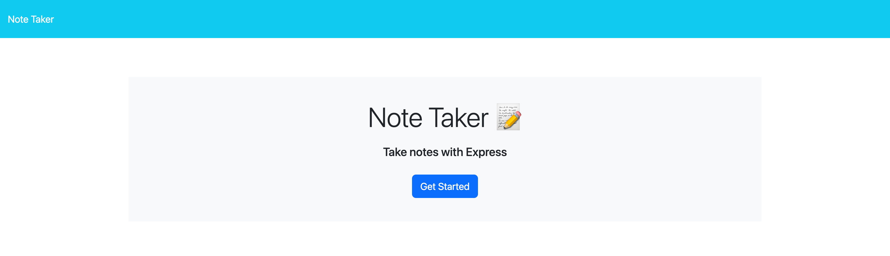
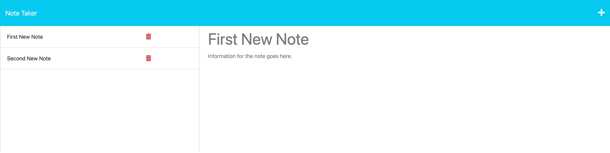

#Express.js Note Taker

## Table of Contents
[Description](#description)
[License](#license)
[Installation](#installation)
[Usage](#usage)
[Contributing](#contributing)
[Tests](#tests)
[Questions](#questions)

## Description

The project objective was to create the back end of a note taking application using express.js to save and retireve note data from a JSON file.

## License

## Installation

Clone the github repo ssh key. Open the terminal and navigate to the /Develop directory. Run "nmp install" to install the dependencies. Run "npm run start". Click the link the local host. 

## Code Structure

This application was created with some starter code provided. The goal was to refactor the code and add a back end using Express.js. The code that was provided created the front end of the application. In order to create the back end of the application a "server.js" file was created. This file sets up a server that will host the different routes that will connect the back end to the front end. There are several different routes added to the server. They are, HTML routes and API routes. Below is a breif description of what these routes handle:
* HTML Routes:
    * GET "/notes" - this route will take the user to the page where all the notes are.
    * GET "*" - this route will take the user back to the home page.

* API Routes:
    * GET "/api/notes" - this route will read the notes that are saved in the JSON file
    * POST "/api/notes" - this route will add a new note to the JSON file and then return the new array of notes.

## Screenshots
Below is a screenshot of the home page.

Below is a screenshot of the notes page.

## Project URLs

## Questions

Click on my GitHub username to view my profile: [Tobin-Matt](https://github.com/Tobin-Matt)

If you would like to reach me with additional questions email me at: tobin.matthew94@gmail.com

